<p align="center">
  <h1 align="center">mama-housing-first</h1>
  <h3 align="center"><em>AI-powered Housing First support — HUD/SAMHSA model, eviction prevention, 5 specialized agents.</em></h3>
</p>

<p align="center">
  <a href="LICENSE"></a>
  
  
  <a href="https://mama.oliwoods.ai"></a>
  <a href="https://mama.oliwoods.ai/foundation"></a>
</p>

---

> *"Housing First works. Studies show 80%+ housing retention rates at two years. The barrier isn't evidence — it's access."*
> — **HUD Annual Homeless Assessment Report, 2023** | 580,000 Americans are homeless on any given night. 40% of them were housed within the past year.

---

## Why This Exists

The Housing First model is proven. The crisis persists because people in housing instability can't navigate a system that was never designed for them.

- **580,000 people** experience homelessness on any single night in the US — HUD AHAR 2023
- **40% of people** who become homeless were previously housed and evicted — Urban Institute 2022
- **Only 1 in 3** eligible households receive federal housing assistance due to funding gaps — CBPP 2023
- **Legal representation** reduces eviction rates by 77% — National Coalition for a Civil Right to Counsel 2021
- Emergency shelter costs **$10,051/person/year** vs. **$4,819** for permanent supportive housing — CSH 2022

**We built this because the gap between Housing First evidence and Housing First access is a solvable coordination problem.**

---

## System Architecture

```mermaid
flowchart TD
    A([Person in Housing Crisis]) --> B{MAMA Intake Agent}
    B --> C[Eligibility Screener\nSection 8 · VASH · HUD-VASH · ESG]
    B --> D[Eviction Defense Agent\nNotice analysis · Tenant rights · Legal aid match]
    B --> E[Benefits Navigator\nHAF · ERA · TANF · Medicaid · SSI]
    B --> F[Waitlist Tracker\nPublic housing · CoC · Voucher portability]
    B --> G[Stability Coach\nRent budgeting · Landlord mediation · Follow-up]

    C --> H[(Supabase\nCase Records)]
    D --> H
    E --> H
    F --> H
    G --> H

    H --> I[SMS / WhatsApp Alerts]
    H --> J[Case Manager Dashboard]
    H --> K[Outcome Analytics]

    style A fill:#7c3aed,color:#fff
    style B fill:#5b21b6,color:#fff
    style H fill:#1e1b4b,color:#fff
```



---

## Features

| Agent | What It Does | Data Sources |
|---|---|---|
| **Intake Agent** | Triages housing situation, urgency scoring, warm handoff | HUD definitions, local CoC data |
| **Eligibility Screener** | Checks Section 8, VASH, HUD-VASH, ESG, local programs | HUD, SAMHSA, state APIs |
| **Eviction Defense Agent** | Parses eviction notices, maps tenant rights by jurisdiction, finds legal aid | Eviction Lab, NLIHC, LSC |
| **Benefits Navigator** | Identifies HAF, ERA, TANF, Medicaid, SSI eligibility gaps | HHS, SSA, state portals |
| **Stability Coach** | Post-housing rent budgeting, landlord mediation scripts, 30/60/90-day check-ins | CFPB financial tools |

### Platform Capabilities
- **Offline-First** — works without internet; essential in shelters and rural areas
- **15+ Languages** — culturally adapted, not just translated
- **Multi-Channel Alerts** — SMS, WhatsApp, email with escalation routing
- **Privacy-First** — no data sold, no tracking, no ads, ever

---

## Quick Start

```bash
git clone https://github.com/OliWoods-Org/mama-housing-first.git
cd mama-housing-first
npm install
npm run dev
```

## Tech Stack

- **Runtime:** Node.js + TypeScript
- **Validation:** Zod schemas
- **Database:** Supabase (PostgreSQL)
- **AI:** Claude API / local LLM (offline mode)
- **Alerts:** Twilio (SMS/WhatsApp), Resend (email)

---

## Research & Citations

- HUD. (2023). *Annual Homeless Assessment Report to Congress*. U.S. Department of Housing and Urban Development.
- National Low Income Housing Coalition. (2023). *The Gap: A Shortage of Affordable Homes*.
- Center on Budget and Policy Priorities. (2023). *Federal Rental Assistance*.
- Eviction Lab, Princeton University. evictionlab.org
- Corporation for Supportive Housing. (2022). *Cost of Homelessness Analysis*.

---

## Contributing

We welcome contributions. This is open source because we believe in community-driven solutions.

1. Fork the repo
2. Create a feature branch (`git checkout -b feat/your-feature`)
3. Commit your changes
4. Push and open a PR

## License

AGPL-3.0 — Free to use, modify, and distribute.

---

<p align="center">
  <strong>Built by the <a href="https://oliwoods.ai">OliWoods Foundation</a></strong><br>
  <em>Free forever. Open source. Because stable housing is a foundation, not a reward.</em>
</p>
